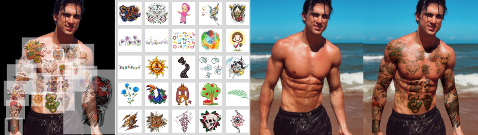

# Tattoo Remover

Easily remove tattoos from images of people using AI!


## Features

- 🎨 Remove tattoos from any part of the body.
- 📸 Supports various image formats.
- 🚀 Fast processing using UNet

## Table of Contents

- [Installation](#installation)
- [Usage](#usage)
- [Contribute](#contribute)
- [License](#license)

## Installation

1. Clone the repo:
   ```bash
   git clone https://github.com/erickillian/tattoo-remover.git
   ```
2. Install python3

    see [https://www.python.org/downloads/](https://www.python.org/downloads/)

3. Install pytorch on your device

    see [https://pytorch.org/get-started/locally/](https://pytorch.org/get-started/locally/) for instructions on how to install pytorch on your device

4. Install python requirements for this project
    ```bash
    pip install -r requirements.txt
    ```

5. Download trained model weights from (.safetensor) available on my huggingface account 
    
    available at [https://huggingface.co/erickillian/tattoo-removal](https://huggingface.co/erickillian/tattoo-removal/tree/main)

    And add model weights into directory

6. Add tattoo photos to test_inputs directory


## Usage

1. Run model on directory

    ```bash
    python3 run.py
    ```

2. Run image_blender.py to get animated transition between image pairs

    ```bash
    python3 image_blender.py
    ```

## Colab Integration

Open notebook in [](https://colab.research.google.com/github/erickillian/tattoo-remover/blob/main/colab_integration.ipynb)

Then run every cell in sequential order.  Replace url in cell 7 with desired image url to try network on different images.  

## Limitations

 - Limited Training Data / dataset diversity
 - Model size (the current UNet model has 124,386,371 parameters which could in fact be too many for the amount of data available)
 - Loss function (Finding an accurate loss function is a large challenge for this model and could definitely be improved)

## Dataset Generation



To generate data for this project a synthetic data approach was used.  Tattoo patterns were overlaid over a subject and then sequentially multiplied onto the subject as layers.  To remove excess tattoo parts background removal was used to remove any background reminants from the image.  The background was then re-added into the image to create an one-to-one tattoo / no tattoo image pair.  To make the overlays more realistic color changing techniques were used.  This was one of the processes used to generate high quality image pairs for this project.

## Contribute

If you are interested in this project and would like to contribute please reach out!  **Email:** [erickill@usc.edu](mailto:erickill@usc.edu)


## License

[MIT](LICENSE.txt)

